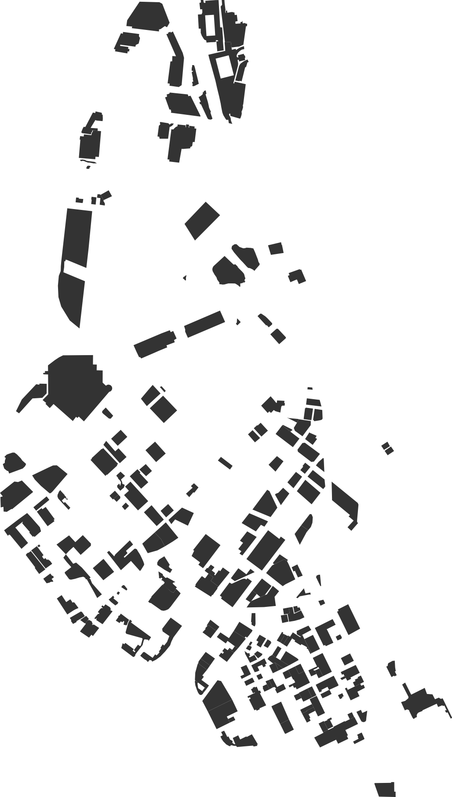
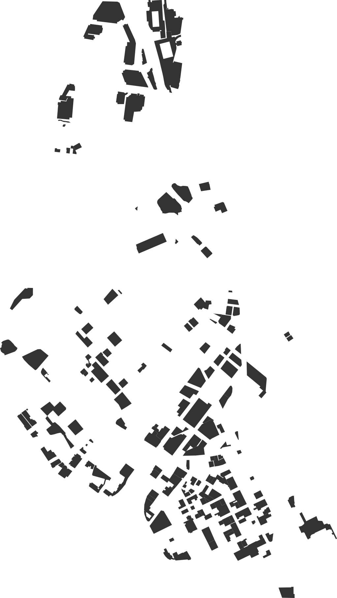

# Outputs

## Capacites

|  type    |   total |   regular |   disabled |
| :--------|--------:|----------:|-----------:|
|  street  |    2163 |      2163 |            |
|  surface |    8026 |      7867 |        159 |
|  TOTAL   |   10189 |     10030 |        159 |

## Land Use

|  type       |   area |   area_square_miles |   percent_parking_area |   percent_downtown_area |
| :-----------|-------:|--------------------:|-----------------------:|------------------------:|
|  surface    | 251990 |           0.0972939 |                  70.57 |                   12.49 |
|  structured | 105105 |           0.0405813 |                  29.43 |                    5.21 |
|  TOTAL      | 357095 |           0.137875  |                 100    |                   17.7  |

## Additional Counts

- % of Surface Lots with `capacity:disabled` set: `29.03225806451613`

	- Number of Surface Lots with `capacity` set: `186`

	- Number of Surface Lots with `capacity:disabled` set: `54`

- number of disabled spaces per *all* surface lots with `capacity` set: `0.8548387096774194`

- number of disabled spaces per surface lots with `capacity:disabled` set: `2.9444444444444446`

## Images

all_lots.png

surface_lots.png

